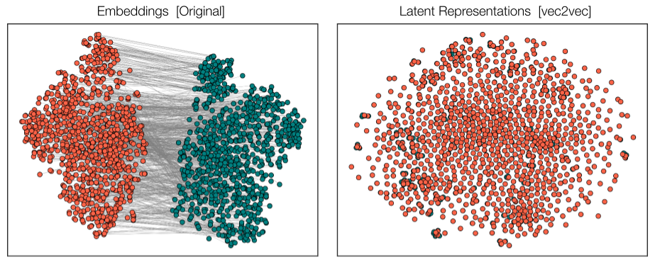

# Vec2Vec

Vec2Vec is a framework for training GANs (Generative Adversarial Networks) to convert between different embedding models. It allows for the transformation of embeddings from one latent space to another while preserving the semantic relationships between vectors.

## Overview

Vec2Vec uses adversarial training to learn mappings between different embedding spaces. It can translate embeddings from unsupervised models like GTE (General Text Embeddings) to supervised models like GTR (General Text Representations), allowing for better alignment and utility of various embedding types.



## Configuration

Vec2Vec uses a TOML configuration file with sections for general settings, translator architecture, discriminator parameters, training hyperparameters, GAN-specific settings, evaluation metrics, and logging options.

## Usage

To run the main unsupervised experiment:

```bash
python train.py unsupervised
```

### Command Line Arguments

The `train.py` script with the `unsupervised` option accepts various parameters, including:

#### General Settings
- `--seed`: Random seed for reproducibility
- `--sampling_seed`: Seed for sampling operations
- `--train_dataset_seed`: Seed for training dataset generation
- `--val_dataset_seed`: Seed for validation dataset generation
- `--normalize_embeddings`: Whether to normalize embeddings
- `--mixed_precision`: Precision mode (e.g., 'fp16')
- `--weight_init`: Weight initialization method
- `--dataset`: Dataset to use (e.g., "nq")
- `--max_seq_length`: Maximum sequence length
- `--unsup_emb`: Unsupervised embedding model (e.g., 'gte')
- `--sup_emb`: Supervised embedding model (e.g., 'gtr')
- `--n_embs_per_batch`: Number of embeddings per batch
- `--finetune_mode`: Enable finetuning mode
- `--noise_level`: Level of noise to add

#### Translator Architecture
- `--translator.
